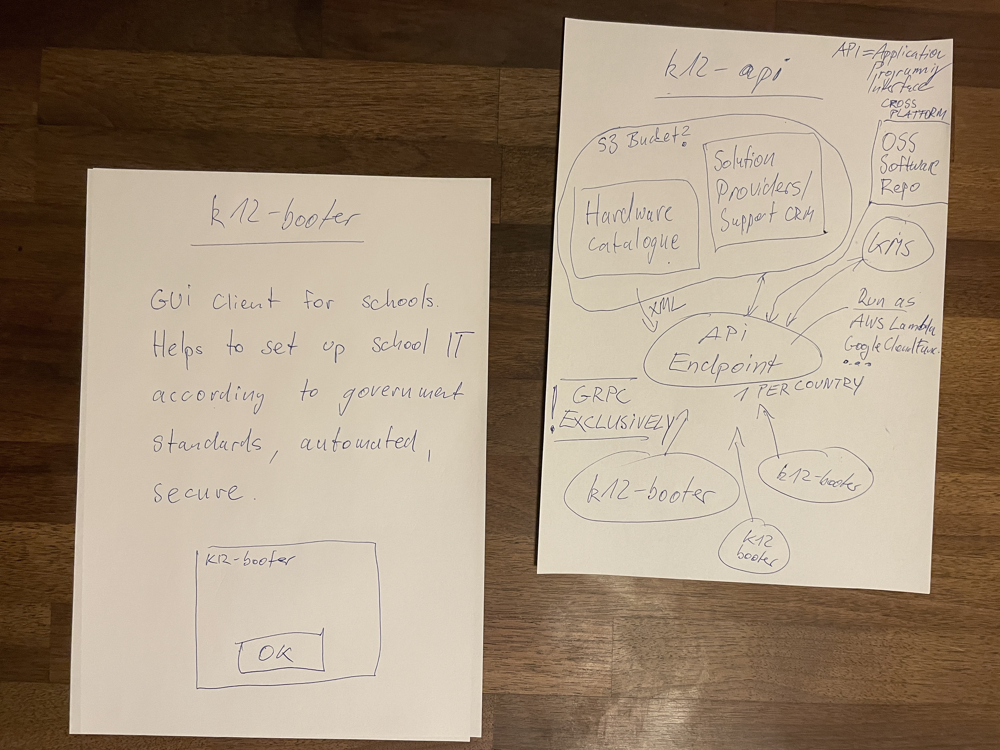

# k12-api

RAW DRAFT IDEAS for k12-booter "server-side" implementation

<blockquote class="twitter-tweet">
<a href="https://twitter.com/hashtag/Quick?src=hash&amp;ref_src=twsrc%5Etfw">#Quick</a> update on <a href="https://twitter.com/hashtag/k12booter?src=hash&amp;ref_src=twsrc%5Etfw">#k12booter</a> <a href="https://twitter.com/hashtag/k12?src=hash&amp;ref_src=twsrc%5Etfw">#k12</a> <a href="https://twitter.com/VP?ref_src=twsrc%5Etfw">@VP</a> <a href="https://twitter.com/NSACyber?ref_src=twsrc%5Etfw">@NSACyber</a>   Another raw draft ... the next part required to get things done.<a href="https://twitter.com/googlecloud?ref_src=twsrc%5Etfw">@googlecloud</a> <a href="https://twitter.com/awscloud?ref_src=twsrc%5Etfw">@awscloud</a> <a href="https://twitter.com/yandexcom?ref_src=twsrc%5Etfw">@yandexcom</a>   Left: k12booter <a href="https://twitter.com/hashtag/GUI?src=hash&amp;ref_src=twsrc%5Etfw">#GUI</a> for teachers. Right: <a href="https://twitter.com/hashtag/k12api?src=hash&amp;ref_src=twsrc%5Etfw">#k12api</a> <a href="https://twitter.com/hashtag/GRPC?src=hash&amp;ref_src=twsrc%5Etfw">#GRPC</a> <a href="https://twitter.com/hashtag/API?src=hash&amp;ref_src=twsrc%5Etfw">#API</a> each countries&#39; government must run e.g. <a href="https://twitter.com/hashtag/AWSLambda?src=hash&amp;ref_src=twsrc%5Etfw">#AWSLambda</a> or <a href="https://twitter.com/hashtag/CloudFunction?src=hash&amp;ref_src=twsrc%5Etfw">#CloudFunction</a> <a href="https://t.co/UbDZYgPVgr">pic.twitter.com/UbDZYgPVgr</a>
&mdash; Jan Arno Hacker, ye olde @schnoddelbotz\r\n (@x4e_ch) <a href="https://twitter.com/x4e_ch/status/1640440175108194304?ref_src=twsrc%5Etfw">March 27, 2023</a></blockquote> 

I have not yet decided who must implement this ...

# Peace - Free Julian Assange

... but I know who must fix this - due to human rights.

<iframe width="560" height="315" src="https://www.youtube.com/embed/chDDhwsynVg" title="YouTube video player" frameborder="0" allow="accelerometer; autoplay; clipboard-write; encrypted-media; gyroscope; picture-in-picture; web-share" allowfullscreen></iframe>
